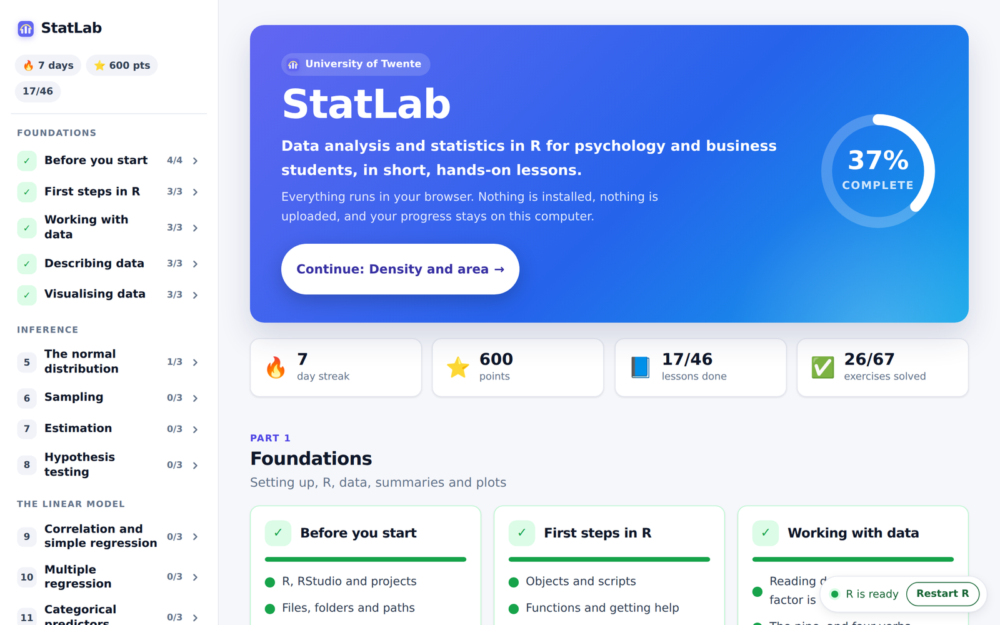
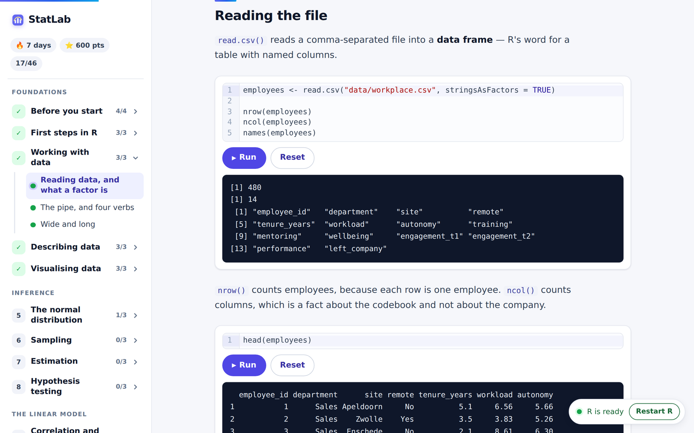
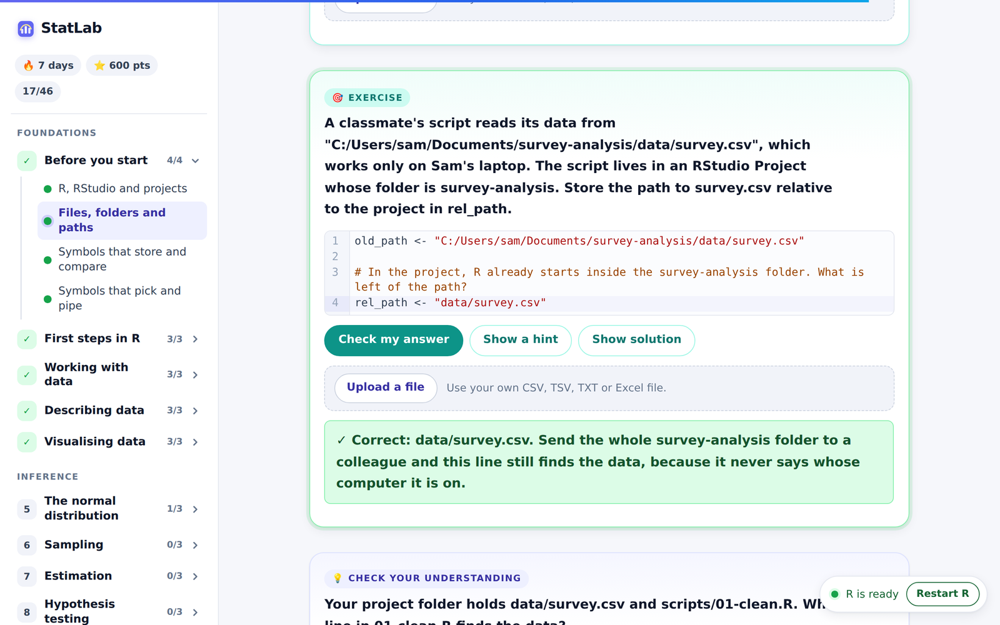
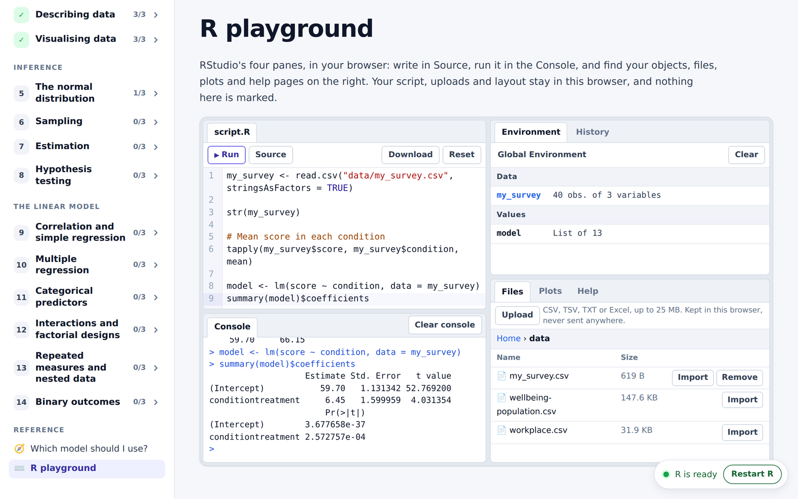
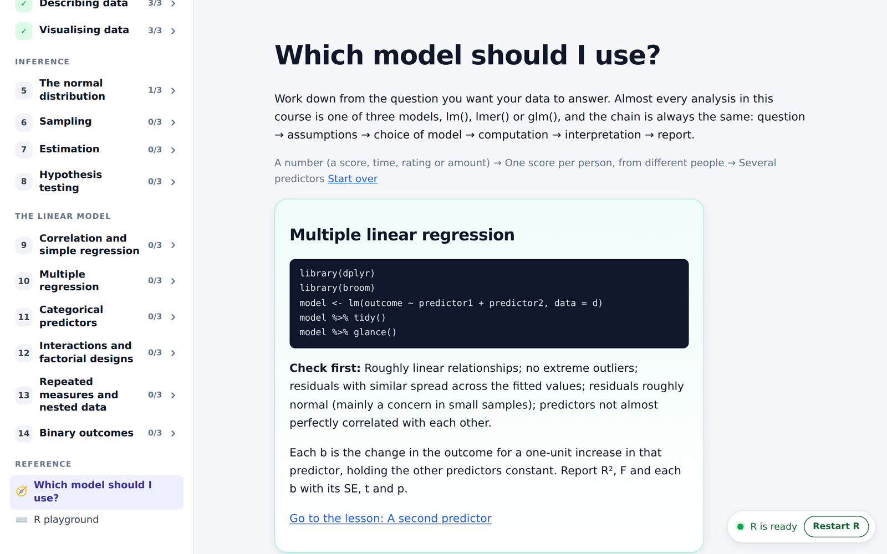
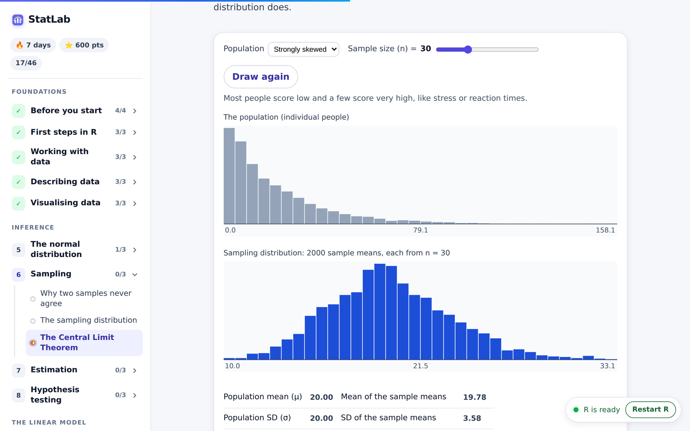
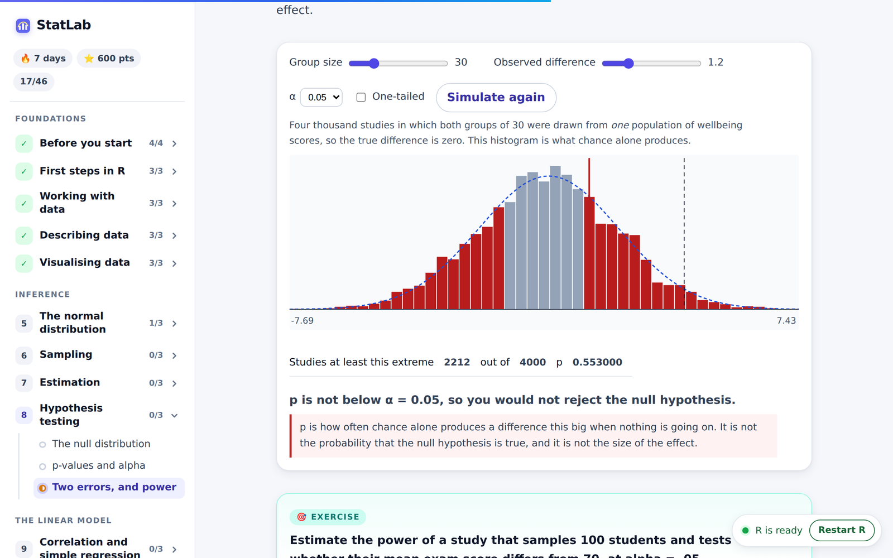
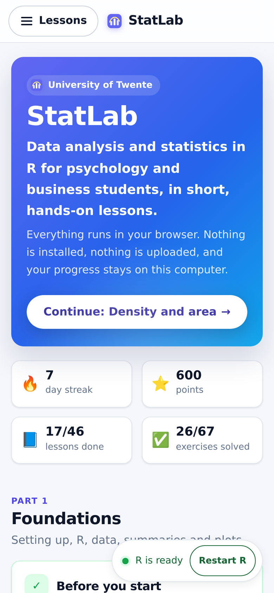

<h1 align="center">StatLab</h1>

  <strong>Hands-on data analysis in R, running entirely in the browser.</strong> 
  Built for psychology and business students at the University of Twente. 
  Made by dr. P.J.H. Slijkhuis and dr. V.d.C. Resendez Gomez, based on materials provided by dr. S.J. Watson.

  <a href="https://peterslijkhuis.github.io/statlab/"><strong>Open StatLab</strong></a>
  &nbsp;·&nbsp;
  <a href="#a-look-inside">Screenshots</a>
  &nbsp;·&nbsp;
  <a href="#whats-in-the-course">The course</a>
  &nbsp;·&nbsp;
  <a href="#run-it-locally">Run it locally</a>
  &nbsp;·&nbsp;
  <a href="#credits">Credits</a>
  &nbsp;·&nbsp;
  <a href="docs/specs/2026-09-14-statlab-r-statistics-webapp-design.md">Design spec</a>

  
  
  

StatLab teaches data analysis with R, from reading a first data file to
fitting linear, mixed and logistic models. All the R code runs in the student's
browser via [webR](https://docs.r-wasm.org/webr/latest/). A student reads a
lesson, commits to a prediction, edits and runs R, and has their answers checked
on the spot. They can also upload their own CSV or Excel file and analyse it in
the same place. There is nothing to install, no backend, no account, and no data
leaves the student's machine.

The statistics is taught the way the course team's own R workshops teach it: in
tidyverse style, and through the linear model. `lm`, `lmer` and `glm` do the
work, and the t-test, ANOVA and chi-square appear as those same models under
their traditional names.

  

## A look inside

<table>
  <tr>
    <td width="50%"></td>
    <td width="50%"></td>
  </tr>
  <tr>
    <td align="center">Every code block is real R: edit it, run it, read the output.</td>
    <td align="center">Exercises are checked in R, with feedback on the specific mistake.</td>
  </tr>
  <tr>
    <td width="50%"></td>
    <td width="50%"></td>
  </tr>
  <tr>
    <td align="center">The R Workspace works like RStudio, with your own uploaded data.</td>
    <td align="center">"Which model should I use?" walks from the question to lm, lmer or glm.</td>
  </tr>
  <tr>
    <td width="50%"></td>
    <td width="50%"></td>
  </tr>
  <tr>
    <td align="center">Module 6: skewed data, and means that still come out normal.</td>
    <td align="center">Module 8: what a p-value is, drawn from four thousand studies.</td>
  </tr>
  <tr>
    <td width="50%"></td>
    <td width="50%"></td>
  </tr>
  <tr>
    <td align="center">Module 9: drag a line and watch the squared residuals shrink.</td>
    <td align="center">Module 7: what "95% confidence" means across a hundred samples.</td>
  </tr>
</table>

It works on a phone too. The sidebar folds into a **Lessons** button, and the
streak, points and progress tiles stack into a grid.

Progress, streaks and points are kept in the browser, and can be exported to a
file and imported on another computer.

 

## What's in the course

**15 modules, 46 lessons, 67 checked exercises and 6 interactive simulations**,
in three parts. Module 0 comes first and sets students up for R on their own
computer.

| | Module | What it covers | Simulation |
|---|---|---|---|
| **Foundations** | | | |
| 0 | Before you start | RStudio Projects, files, folders and paths, and what R's symbols mean, with a cheat sheet | |
| 1 | First steps in R | Objects, functions, help, packages and `library()` | |
| 2 | Working with data | `read.csv`, factors, the pipe, `select`, `filter`, `mutate`, wide and long data | |
| 3 | Describing data | `group_by` and `summarise`, mean versus median, surprises in a summary | |
| 4 | Visualising data | ggplot2 as layers, facets, and an APA-ready figure | |
| **Inference** | | | |
| 5 | The normal distribution | Density, z-scores and probabilities | Distribution |
| 6 | Sampling | Sampling error, sampling distributions, the Central Limit Theorem | Central Limit Theorem |
| 7 | Estimation | Standard errors, confidence intervals, SD, SE and CI error bars | Confidence intervals |
| 8 | Hypothesis testing | Null distributions, p-values, Type I and II errors, power | p-values and power |
| **The linear model** | | | |
| 9 | Correlation and simple regression | `lm(y ~ x)`, reading model output with `tidy()` and `glance()` | Correlation, least squares |
| 10 | Multiple regression | Several predictors, each slope holding the others constant, reporting R² and F | |
| 11 | Categorical predictors | The t-test as `lm`, dummy coding, `emmeans` pairwise comparisons | |
| 12 | Interactions and factorial designs | `a * b`, sum-to-zero contrasts, Type III tests with `car`, interaction plots | |
| 13 | Repeated measures and nested data | `lmer` with `(1 \| id)`, fixed and random effects, the paired t-test | |
| 14 | Binary outcomes | `glm(..., family = binomial)`, log odds, odds ratios and reporting | |

Each lesson is written in MDX from a small set of blocks:

- **Predict** asks the student to commit to an answer before the code or
  simulation that settles it.
- **CodeBlock** is an editable R editor with console output, warnings, errors
  and plots.
- **Exercise** is a task whose answer is checked in R.
- **Quiz** is a conceptual multiple-choice question with an explanation.
- **Interpret** closes inferential lessons: pick the right reading of the output
  and the right APA-style sentence.
- **Simulation** embeds one of the six simulations.

Alongside the lessons there is an **R Workspace** at `/workspace` (the old
`/playground` address redirects there) and a **"Which model should I use?"**
guide at `/which-model` (the old `/which-test` address redirects there), which
walks from the design of a study to `lm`, `lmer` or `glm` and links to the
lesson that covers each case.

The R Workspace has RStudio's panes, so a student without R on their own
computer, on a Chromebook for example, can do a whole analysis in it: several
script tabs kept in the browser, their own uploaded data, and Download for
anything R writes. `install.packages()` and `library()` fetch any package from
webR's repository (most of CRAN, built for the browser), the Packages pane lists
recommended packages and the few that cannot run in a browser, and the script
editor has RStudio's Tab completion and shortcuts.

Progress is kept in the browser's `localStorage` and can be exported and
imported as JSON from the home page.

Two fictional, generated datasets carry the course: a population of 5000
students (`wellbeing-population.csv`) for the sampling modules, and a workplace
study of 480 employees (`workplace.csv`) built so that every model in the
linear-model part has a real effect to find.

## Credits

StatLab was made by **dr. P.J.H. Slijkhuis** and **dr. V.d.C. Resendez Gomez**,
based on materials provided by **dr. S.J. Watson**.

  
  &nbsp;&nbsp;&nbsp;
  

It is a project of the [University of Twente](https://www.utwente.nl/en/) and
[The BMS Lab](https://bmslab.utwente.nl/). The same credit shows at the foot of
the sidebar on every page of the site and at the bottom of the home page. The
partner logos are in `src/assets/logos/`, picked up by file name;
see the README there to replace one.
