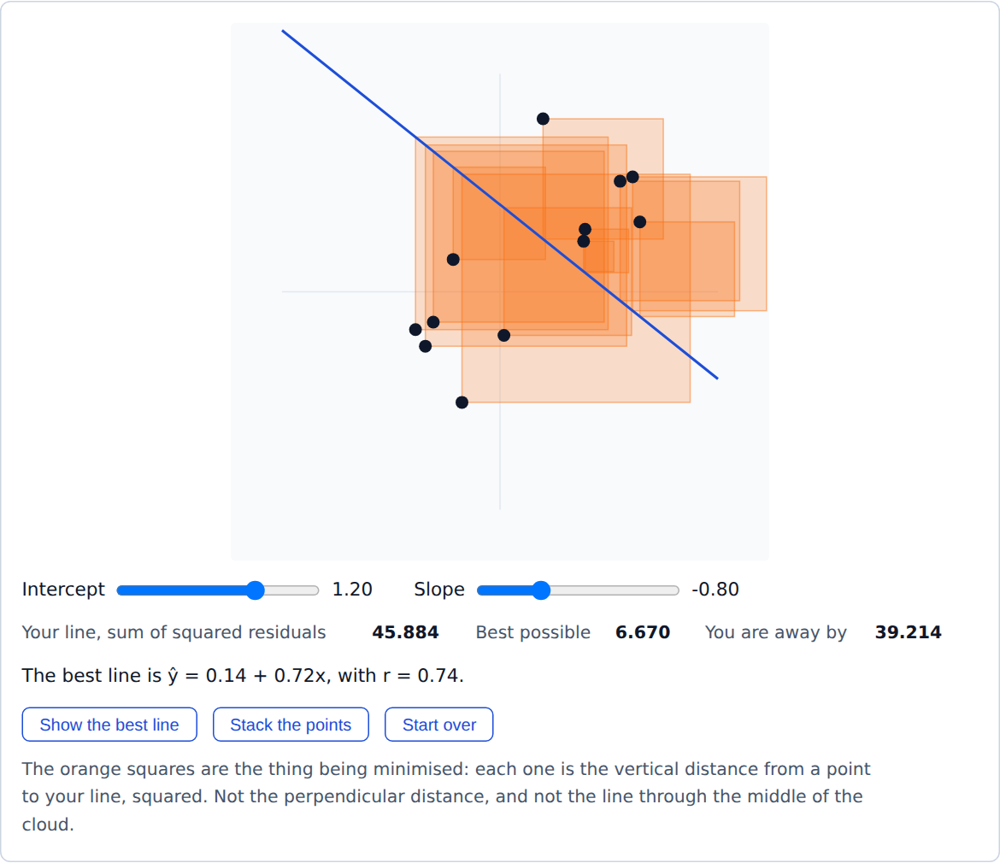
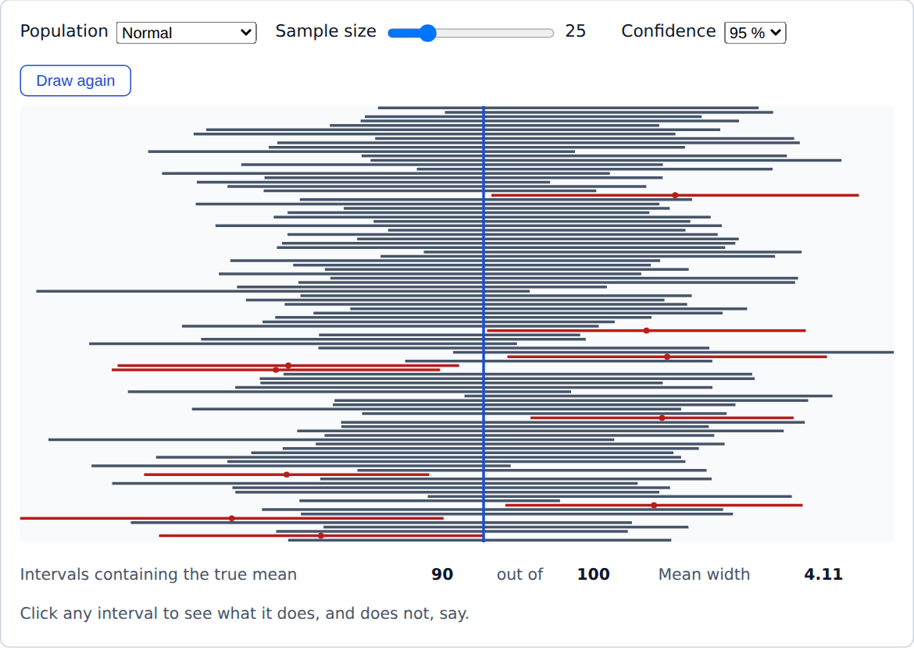

<h1 align="center">StatLab</h1>

<p align="center">
  <strong>Interactive statistics and R, running entirely in the browser.</strong><br>
  For psychology and business students at the University of Twente.
</p>

<p align="center">
  <a href="https://peterslijkhuis.github.io/statlab/"><strong>Open StatLab</strong></a>
  &nbsp;·&nbsp;
  <a href="#whats-in-the-course">The course</a>
  &nbsp;·&nbsp;
  <a href="#run-it-locally">Run it locally</a>
  &nbsp;·&nbsp;
  <a href="docs/specs/2026-09-14-statlab-r-statistics-webapp-design.md">Design spec</a>
</p>

<p align="center">
  <a href="https://github.com/PeterSlijkhuis/statlab/actions/workflows/deploy.yml"></a>
  
  
</p>

StatLab teaches introductory statistics through real R code that runs in the
student's browser via [webR](https://docs.r-wasm.org/webr/latest/). A student
reads a lesson, commits to a prediction, edits and runs R, and has their answers
checked on the spot. There is nothing to install, no backend, no account, and no
data leaves the student's machine.

Statistics is taught the way the course team's own R workshops teach it: in
tidyverse style, and through the linear model. `lm`, `lmer` and `glm` do the
work, and the t-test, ANOVA and chi-square appear as those same models under
their traditional names.

<table>
  <tr>
    <td width="50%"></td>
    <td width="50%"></td>
  </tr>
  <tr>
    <td align="center"><sub>Module 9: drag a line and watch the squared residuals shrink.</sub></td>
    <td align="center"><sub>Module 7: what "95% confidence" means across a hundred samples.</sub></td>
  </tr>
</table>

## What's in the course

**14 modules, 42 lessons, 61 checked exercises and 6 interactive simulations**,
in three parts.

| | Module | What it covers | Simulation |
|---|---|---|---|
| **Foundations** | | | |
| 1 | First steps in R | Objects, functions, help, packages and `library()` | |
| 2 | Working with data | `read.csv`, factors, the pipe, `select`, `filter`, `mutate`, wide and long data | |
| 3 | Describing data | `group_by` and `summarise`, mean versus median, surprises in a summary | |
| 4 | Visualising data | ggplot2 as layers, facets, and an APA-ready figure | |
| **Inference** | | | |
| 5 | The normal distribution | Density, z-scores and probabilities | Distribution |
| 6 | Sampling | Sampling error, sampling distributions, the Central Limit Theorem | Central Limit Theorem |
| 7 | Estimation | Standard errors, confidence intervals, SD, SE and CI error bars | Confidence intervals |
| 8 | Hypothesis testing | Null distributions, p-values, Type I and II errors, power | p-values and power |
| **The linear model** | | | |
| 9 | Correlation and simple regression | `lm(y ~ x)`, reading model output with `tidy()` and `glance()` | Correlation, least squares |
| 10 | Multiple regression | Several predictors, each slope holding the others constant, reporting R² and F | |
| 11 | Categorical predictors | The t-test as `lm`, dummy coding, `emmeans` pairwise comparisons | |
| 12 | Interactions and factorial designs | `a * b`, sum-to-zero contrasts, Type III tests with `car`, interaction plots | |
| 13 | Repeated measures and nested data | `lmer` with `(1 \| id)`, fixed and random effects, the paired t-test | |
| 14 | Binary outcomes | `glm(..., family = binomial)`, log odds, odds ratios and reporting | |

Each lesson is written in MDX from a small set of blocks:

- **Predict** asks the student to commit to an answer before the code or
  simulation that settles it.
- **CodeBlock** is an editable R editor with console output, warnings, errors
  and plots.
- **Exercise** is a task whose answer is checked in R.
- **Quiz** is a conceptual multiple-choice question with an explanation.
- **Interpret** closes inferential lessons: pick the right reading of the output
  and the right APA-style sentence.
- **Simulation** embeds one of the six simulations.

Alongside the lessons there is an **R playground** and a **"Which model should I
use?"** guide at `/which-model` (the old `/which-test` address redirects there),
which walks from the design of a study to `lm`, `lmer` or `glm` and links to the
lesson that covers each case. Progress is kept in the browser's `localStorage`
and can be exported and imported as JSON from the home page.

Two fictional, generated datasets carry the course: a population of 5000
students (`wellbeing-population.csv`) for the sampling modules, and a workplace
study of 480 employees (`workplace.csv`) built so that every model in the
linear-model part has a real effect to find.

## Run it locally

You need Node 22 or newer.

```bash
npm ci        # install, and apply patches/webr+0.6.0.patch
npm run dev   # start the development server
```

The first page load downloads R and the core packages (`dplyr`, `ggplot2`,
`tidyr`, `broom`) from the webR CDN, so it needs a network connection and takes
a while. Later loads come from the browser cache. The lessons that need
`emmeans`, `car`, `lme4` or `lmerTest` install them when they open.

| Command | What it does |
|---|---|
| `npm run dev` | Vite development server |
| `npm run build` | Type check, then build to `dist/` |
| `npm run preview` | Serve the built site from `dist/` |
| `npm test` | All unit tests, plus the integration tests that boot real R |
| `npm run validate` | The three content checks below, in order |
| `npm run e2e` | Playwright smoke tests against the built site |
| `npm run data` | Regenerate both datasets in `public/data/` |

## How it's tested

The course's correctness rests on content validation, which `npm run validate`
runs in three steps:

| Step | Command | What it checks |
|---|---|---|
| 1 | `npm run check:data` | The committed workplace dataset still carries the effects the lessons teach against |
| 2 | `npm run validate:static` | Every lesson compiles, every exercise is placed in a lesson, and every package a lesson names can be installed |
| 3 | `npm run validate:r` | Every lesson code block and every exercise fixture, run in real R |

Steps 1 and 2 run anywhere. Step 3, and the R integration tests in `npm test`,
download R and packages from `webr.r-wasm.org` and `repo.r-wasm.org`; on a
machine that cannot reach both they fail with `Could not install ...`, and the
rest of the suite still runs. CI always runs the full set.

After any change to `scripts/generate-datasets.mjs`, run `npm run check:data`.
A seeded draw can quietly lose an effect the generator was meant to put in.

### How exercises are checked

An exercise declares a `check`: an R snippet returning
`list(pass = <logical>, message = <character>)`. Checks compare **values, not
source text**, and read the student's objects only through `has_answer()` and
`answer()`, which look in the attempt's own environment. That matters because a
lesson's code blocks create the very objects an exercise asks for; without it,
an empty submission would pass.

Four outcomes are kept apart, so a student is never told their answer is wrong
when something else broke: *pass*, *fail*, *your code did not run*, and *this
check is broken*.

Every exercise carries a reference solution, plausible wrong answers, and the
other correct routes a student might take. The R validator requires every
solution to pass and every wrong answer to be rejected by the check itself, not
by an error.

## Deployment

GitHub Actions ([`deploy.yml`](.github/workflows/deploy.yml)) runs on every
pull request and every push to `main`:

1. **verify**: type check, static content validation, the dataset check, unit
   tests, then content validation in real R.
2. **e2e**: Playwright smoke tests against the built site in Chromium.
3. **build** and **deploy**, on `main` only: build, add a `404.html` copy of
   `index.html` so deep links survive a reload, and publish to GitHub Pages.

Anything red in the first two jobs blocks the deploy. The live site is at
**https://peterslijkhuis.github.io/statlab/**.

Two settings live outside the repository:

- **Pages must deploy from GitHub Actions** (Settings, then Pages, then Source).
  A branch source makes the build job fail at `configure-pages`.
- **The repository must stay public**, unless the account is on a paid plan.
  GitHub Pages does not serve private repositories on the free plan.

Vite is configured with `base: '/statlab/'` and the router uses the same
basename. Both are needed, or the deployed site renders blank.

### The webR patch

`patches/webr+0.6.0.patch` is applied by `patch-package` on install. It makes
one change to webR's worker: the Node code path wraps a resolved filesystem path
in `pathToFileURL` before importing it, because Node's ESM loader rejects a
Windows path such as `C:\...`. It affects only Node, where the content validator
runs, not the browser.

## Project layout

```
src/
  components/    lesson blocks: CodeBlock, Exercise, Predict, Quiz, Interpret, Simulation
  content/
    lessons/     the 42 lessons, as MDX
    exercises/   exercise definitions and their fixtures, one file per module
    manifest.ts  modules, lessons and the packages each lesson needs
  pages/         Home, Lesson, Playground, and the model chooser
  r/             webR client, session setup, evaluation and exercise checking
  sims/          the six simulations and their seeded random number generator
  state/         progress in localStorage
public/data/     the two course datasets
scripts/         dataset generator and the dataset effect check
e2e/             Playwright smoke tests
docs/
  specs/         the design specification
  plans/         implementation plans
```

The design specification in `docs/specs/` is the reference for how
the runtime, the lesson blocks, exercise checking and the curriculum are meant
to work.
